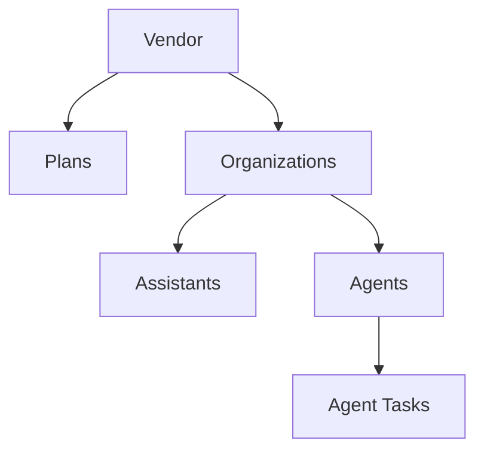

Deepslate Realtime is a platform for building and deploying voice AI at scale. Power inbound call handling with **Assistants** or automate outbound campaigns with **Agents** — all backed by Opal, our end-to-end speech-to-speech model.

## Voice AI Resources

<CardGroup cols={2}>
  <Card title="Assistants" icon="phone-volume">
    **Inbound voice AI** that answers calls to your phone numbers. Configure behavior with system prompts, greetings, and integrations.
  </Card>
  <Card title="Agents" icon="phone-arrow-up-right">
    **Outbound voice AI** that proactively calls customers. Assign tasks with dynamic data for personalized conversations.
  </Card>
</CardGroup>

## Resource Hierarchy

<AccordionGroup>
  <Accordion title="Assistants" icon="phone-volume">
    Voice AI for handling **inbound calls**. When someone calls your phone number, an assistant answers and handles the conversation.

    **Configuration options:**
    | Setting | Description |
    |---------|-------------|
    | System prompt | Define the assistant's role and behavior |
    | Greeting | Initial message when answering a call |
    | LLM extensions | Add capabilities like knowledge base search |
    | Call event hooks | Trigger webhooks on call events (e.g., transcript ready) |
  </Accordion>

  <Accordion title="Agents" icon="phone-arrow-up-right">
    Voice AI for making **outbound calls**. Agents proactively call customers based on assigned tasks.

    **Configuration options:**
    | Setting | Description |
    |---------|-------------|
    | System prompt template | Define the agent's role with dynamic variables |
    | User value types | Define data fields for each call (customer name, order ID, etc.) |
    | LLM extensions | Add capabilities like CRM lookups |
    | Call event hooks | Trigger webhooks on call events |
  </Accordion>

  <Accordion title="Agent Tasks" icon="list-check">
    Individual outbound call tasks assigned to agents. Each task contains:

    - **Target number** — The phone number to call
    - **User values** — Key-value pairs with call-specific data (e.g., customer name, callback reason)

    Tasks are processed by agents and can be created via the API for automated campaign workflows.
  </Accordion>
</AccordionGroup>

---

## Platform Structure

<Note>
Deepslate supports white-label reselling with a multi-tier vendor model. Vendors can set their own pricing and billing through Stripe.
</Note>

<AccordionGroup>
  <Accordion title="Vendors" icon="building">
    Vendors are businesses that resell the Deepslate platform as a white-label solution.

    **Capabilities:**
    - Create custom branding for their voice AI offering
    - Define their own pricing plans with custom rates and usage limits
    - Charge customers directly through their own Stripe credentials
    - Manage organizations (their customers) under their account

    <Tip>
    Vendors can onboard other businesses that either become **end-user organizations** or **vendors themselves**, enabling multi-tier distribution models.
    </Tip>
  </Accordion>

  <Accordion title="Organizations" icon="users">
    Organizations are the end-user businesses within a vendor's ecosystem.

    Each organization:
    - Belongs to exactly one vendor
    - Has an assigned pricing plan
    - Can create and manage assistants and agents
    - Receives invoices based on their vendor's pricing structure
  </Accordion>

  <Accordion title="Plans" icon="credit-card">
    Pricing configurations that define usage limits and rates for organizations.

    | Feature | Description |
    |---------|-------------|
    | Included minutes | Bundled inbound/outbound minutes per billing period |
    | Per-minute pricing | Rate charged for usage |
    | Overage rates | Pricing for usage beyond included minutes |
    | Usage limits | Hard caps and enforcement rules |
  </Accordion>
</AccordionGroup>

## Next Steps

<Card title="API Reference" icon="code" href="/api-reference/introduction">
  Explore the REST API for managing resources programmatically
</Card>
