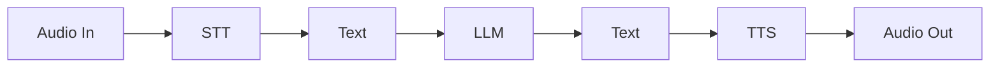

Opal is Deepslate's proprietary end-to-end speech-to-speech (S2S) model. Unlike traditional voice AI systems that chain together separate components, Opal processes audio input and generates audio output in a single unified model.

## What Makes Opal Different

<CardGroup cols={2}>
  <Card title="No ASR Pipeline" icon="bolt">
    Direct speech processing means faster responses and better context awareness. No transcription errors to compound.
  </Card>
  <Card title="Ultra-Low Latency" icon="gauge-high">
    Sub-300ms first byte latency enables natural turn-taking that feels human, not robotic.
  </Card>
  <Card title="High Intelligence" icon="brain">
    Advanced reasoning with complex instruction following, context retention, and task completion.
  </Card>
  <Card title="Emotion Awareness" icon="face-smile">
    Understands emotional cues and responds with appropriate tone and inflection.
  </Card>
</CardGroup>

## Core Architecture

<Note>
Unlike traditional voice AI that chains separate ASR, LLM, and TTS components, Opal understands speech directly. This eliminates latency penalties and error propagation between stages.
</Note>

### Traditional Cascaded Approach



Each stage introduces latency. Transcription errors compound through the pipeline. Total response time is the sum of all components.

### Opal End-to-End Approach

Opal supports two output modes depending on your use case:

<Tabs>
  <Tab title="Full Speech-to-Speech">
    ```mermaid
    flowchart LR
        A[Audio In] --> B[Speech Encoder]
        B --> C[Embedding]
        C --> D[LLM]
        D --> E[Embedding]
        E --> F[Speech Decoder]
        F --> G[Audio Out]
    ```

    The model operates entirely in embedding space, preserving acoustic information that would be lost in text-based intermediate representations. No transcription step means no transcription errors.
  </Tab>
  <Tab title="Speech-to-Text">
    ```mermaid
    flowchart LR
        A[Audio In] --> B[Speech Encoder]
        B --> C[Embedding]
        C --> D[LLM]
        D --> E[Text Out]
    ```

    Use this mode when speech synthesis is not required (e.g. transcription workflows) or when you want to use external TTS providers like **ElevenLabs** or **Cartesia** for voice generation.
  </Tab>
</Tabs>

## Performance Comparison

| Metric | Opal | Traditional Cascade |
|--------|-------|---------------------|
| First byte latency | **Under 300ms** | 800-1500ms |
| Turn-taking gap | **Natural** | Noticeable delay |
| Interruption handling | **Native** | Often problematic |
| Error propagation | **None** | Compounds across stages |

## Key Capabilities

<AccordionGroup>
  <Accordion title="High Intelligence & Instruction Following" icon="brain">
    Opal combines speech understanding with advanced reasoning:

    - **Complex instruction following** — Handles multi-step requests and nuanced instructions
    - **Context retention** — Maintains conversation context across long interactions
    - **Domain adaptation** — Quickly adapts to specialized terminology and workflows
    - **Task completion** — Drives conversations toward defined goals while handling edge cases
  </Accordion>

  <Accordion title="Voice Preservation & Custom Voices" icon="microphone">
    Opal maintains consistent voice characteristics throughout conversations or adopts custom voice profiles. This enables branded voice experiences that match your organization's identity.
  </Accordion>

  <Accordion title="Emotion & Tone Awareness" icon="face-smile">
    The model understands emotional cues in speech and responds appropriately:

    - Detecting caller frustration, confusion, or satisfaction
    - Adjusting response tone to match the situation
    - Conveying empathy, urgency, or reassurance as needed
  </Accordion>

  <Accordion title="Multilingual Support" icon="globe">
    Opal supports multiple languages and accents, enabling global deployment without requiring separate models for each locale.
  </Accordion>

  <Accordion title="Streaming Inference" icon="wave-pulse">
    Opal supports streaming in both directions:

    - **Input streaming** — Begins processing before the speaker finishes
    - **Output streaming** — Starts speaking while still generating the response

    This enables natural interruption handling and reduces perceived latency.
  </Accordion>
</AccordionGroup>

## Integration with Deepslate Realtime

Opal powers both **Assistants** (inbound) and **Agents** (outbound) on the Deepslate platform. When you configure an assistant or agent, you're defining the behavior, knowledge, and goals — Opal handles the real-time voice interaction.

<CardGroup cols={2}>
  <Card title="Assistants" icon="phone-volume" href="/concepts#assistants">
    Handle inbound calls with AI-powered voice conversations
  </Card>
  <Card title="Agents" icon="phone-arrow-up-right" href="/concepts#agents">
    Make outbound calls for proactive customer outreach
  </Card>
</CardGroup>
