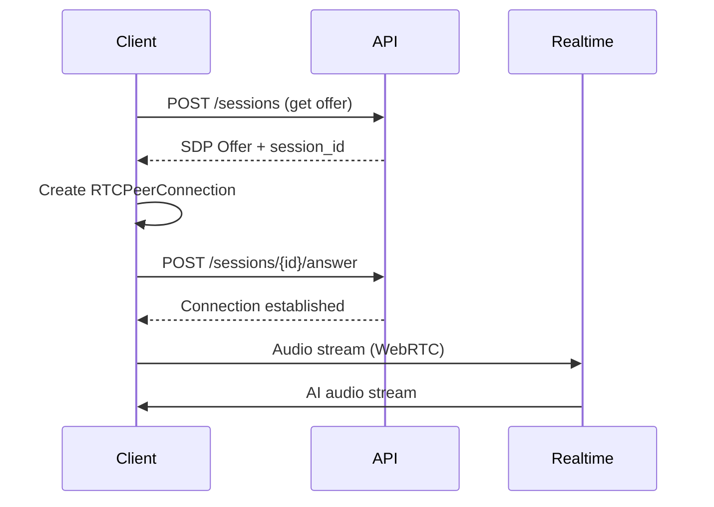

WebRTC is best for web applications, mobile apps, and end-user facing interfaces with ultra-low latency and built-in NAT traversal.

## Session Flow



## Step 1: Create Session

Request a WebRTC session from the API:

```javascript
const response = await fetch('https://app.deepslate.eu/api/v1/sessions', {
  method: 'POST',
  headers: {
    'Authorization': 'Bearer YOUR_API_KEY',
    'Content-Type': 'application/json'
  },
  body: JSON.stringify({
    assistant_id: 'asst_xxx',
    protocol: 'webrtc'
  })
});

const { session_id, sdp_offer } = await response.json();
```

## Step 2: Establish Connection

```javascript
const pc = new RTCPeerConnection();

// Add local audio track
const stream = await navigator.mediaDevices.getUserMedia({ audio: true });
stream.getTracks().forEach(track => pc.addTrack(track, stream));

// Handle remote audio
pc.ontrack = (event) => {
  const audio = new Audio();
  audio.srcObject = event.streams[0];
  audio.play();
};

// Set remote offer and create answer
await pc.setRemoteDescription({ type: 'offer', sdp: sdp_offer });
const answer = await pc.createAnswer();
await pc.setLocalDescription(answer);

// Send answer to server
await fetch(`https://app.deepslate.eu/api/v1/sessions/${session_id}/answer`, {
  method: 'POST',
  headers: {
    'Authorization': 'Bearer YOUR_API_KEY',
    'Content-Type': 'application/json'
  },
  body: JSON.stringify({ sdp: answer.sdp })
});
```

## Audio Configuration

<Note>
WebRTC uses Opus codec at 48kHz by default. Deepslate automatically handles sample rate conversion.
</Note>

| Format | Sample Rate | Channels | Notes |
|--------|-------------|----------|-------|
| Opus | 48000 Hz | Mono | Browser default |
| Opus | 16000 Hz | Mono | Mobile optimized |

## Error Handling

<AccordionGroup>
  <Accordion title="Connection Errors" icon="triangle-exclamation">
    | Code | Description | Resolution |
    |------|-------------|------------|
    | `auth_failed` | Invalid or expired API key | Check your API key |
    | `rate_limited` | Too many concurrent sessions | Reduce connection rate |
    | `invalid_config` | Invalid assistant/agent ID | Verify resource exists |
  </Accordion>

  <Accordion title="Runtime Errors" icon="bug">
    | Code | Description | Resolution |
    |------|-------------|------------|
    | `ice_failed` | ICE connection failed | Check network/firewall settings |
    | `session_timeout` | Session idle too long | Reconnect |
    | `internal_error` | Server-side error | Retry with backoff |
  </Accordion>
</AccordionGroup>

## Browser Compatibility

| Browser | Support |
|---------|---------|
| Chrome | Full support |
| Firefox | Full support |
| Safari | Full support (iOS 14.3+) |
| Edge | Full support |
